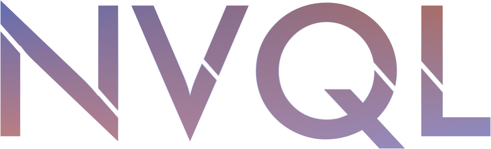

# NvQL


Unified Database Layer Library for postgres, ~~oracle, mysql &amp; sqlite~~ database-beside postgres still WIP for C++ 17.<br/>
Consistent API across databases, high productivity, reusable and low overhead.<br/>

All query executions are using ```prepared statement``` and NvQL handles it for you.<br/>
Alltough we still give you ```ExecuteNonPrepared``` method for handling some certain case.

```NvQL``` is being developed primarily for hiqh productivity & reusable  efficient approach of c++ unified data layer library for NvServ, a rapid server framework.

Serving for easy to use low overhead unified abstraction data layer

> [!WARNING]
> Currently compatibility with C++14 is not yet throughly tested.<br/>
> Status : WIP, Experimental & Unstable.
>

### Example

```cxx

#include <iostream>
#include <memory>

#include "nvserv/storages/postgres/pg_server.h"

int main() {
  using namespace nvserv::storages;
  using namespace nvserv::storages::parameters;

  // Only clusters, DB server declaration and dialect that are DB Specific
  // For NvQL executions are abstracted through unified API.
   
  // Connect to standalone Postgres DB Server
  // Connection pool with 5 connections standby, max 10 connections
  auto clusters = {postgres::PgClusterConfig(
      "db-example", "the-user", "the-password", "localhost", 5433)};
  StorageServerPtr server = postgres::PgServer::MakePgServer(clusters, 5, 10);

  try {
    server->TryConnect();
    auto tx = server->Begin(TransactionMode::ReadOnly);

    auto status_filter = Param::SmallInt(1);
    auto result = tx->Execute("select * from customer where status = $1",
                              status_filter);

    if (result->Empty()) {
      std::cout << "No customers data.." << std::endl;
      server->Shutdown();
      return 0;
    }

    auto cursor = Cursor(*result);
    for (const auto row : cursor) {
      auto cust_id = row->As<int32_t>("cust_id");
      auto name = row->As<std::string>("name");
      auto member_type = row->As<std::string>("member_type");
      auto phone_number = row->As<std::string>("phone_number");
      auto status = row->As<int32_t>("status");
      auto dob = row->AsDateTimeOffset<nvm::dates::DateTime>("dob");

      std::cout << "[" << cust_id << "] " << name << " (" << member_type << ":"
                << phone_number << ", " << dob << ", " << status << ")"
                << std::endl;
    }

    server->Shutdown();

  } catch (const StorageException& e) {
    std::cerr << e.what() << '\n';
  }

  return 0;
}

```

### Tuple binding support

NvQL have tuple binding support out-of-the-box.<br/>
We dont recommend to use it at for-range-loop iteration position, because it hinder code clarity.

```Mapper::Dynamic<T...>()``` can also be use for casting to another type directly.

```cxx

auto cursor = Cursor(*result);
for (const auto row : cursor) {

auto dyn = Mapper::Dynamic<std::string, std::string, std::string>(
    row, {"user_id", "username", "status"});

auto cust_id = std::get<0>(dyn);  
auto name = std::get<1>(dyn);     
auto status = std::get<2>(dyn);  

std::cout << name << " {id: " << cust_id << "; status: " << status
          << "; query time: ";}"
          << std::endl;
}

```

### Struct Binding/Mapping Support

NvQL has feature to directly map the tuple from ```Mapper::Dynamic<T...>```<br/>
directly to struct with requirement for mapping:
- The order of type between struct & tuple MUST be match.
- Incase of unmatched type will be fine IF the type can be implicitly casting.
- Other than state previouly will throw an exceptions.

```cpp

struct User {
  int32_t user_id;
  std::string username;
  int16_t status;
};

auto cursor = Cursor(*result);
for (const auto row : cursor) {
  auto dyn = Mapper::Dynamic<int32_t, std::string, int16_t>(
    row, {"user_id", "username", "status"});

  auto u = Mapper::Map<User, typeof(dyn)>(dyn);

  auto cust_id = u.user_id;
  auto name = u.username;
  auto status = u.status;

  std::cout << name << " {id: " << cust_id << "; status: " << status
            << ";" << std::endl;

}

```

### <u>Database supported</u>
- Postgres : WIP
- Oracle : WIP
- Mysql : Plan
- Sqlite: Plan

### Features

- Unified API: Simplifies switching between different databases.
- Transaction Management: Automatic transaction handling with default support for prepared statements.
- Async Execution: All the query executions are executed async and managed by internal TaskPool.
- Cluster Connection: Supports connection pooling and fallback mechanisms.
- Binary Transport Protocol: Uses binary protocols if supported for efficiency.
- Extensible: Provides access to underlying DB libraries for advanced use cases.
- High productivity: No more sacrificing quality vs development time

### Namespace Notes
When using standalone library from this repo.
The root name is same with root namespace from NvServ

<b>NvQL Namespace</b><br/>
NvQL was developed as part of NvServ so to retain interoperability<br/> 
between standalone & nvserv, NvQL still keep the namespace of nvserv

```cpp
  namespace nvserv::storages
```

## Design Concept

Inspired by userver microservice framework,<br/>
we're decided to take it further into unified data layer.<br/>

In-short, no matter database you use, all the API design are consistent and polymorphed across different DB.<br/>
High quality, High productivity whatever database you choose.

## Query Execution Implementations

NvQL by default decided the query execution approach only took certain methods and declare the approach as the first-class citizen and being implement under-the-hood.
- ```Execute()``` : Query executions via prepared statement & parameter values.
- ```ExecuteNonPrepared()``` : Non prepares statement query executions & parameter values support.
- All the query executions are transaction based.
- NvQL manages the prepared statement routines & boilerplate, developer just need to send the SQL query with parameters and that's all.
- Cluster Connection & fallback mechanism
- Connection Pool & connection idle wake up
- Transaction Mode (options to choose different mode of transactions)
- Binary Transport Protocol when supported & fallback mechanism
- Parameterized parameter (with support for specific DB parameter type)
  
NvQL manages the acquiring, returning connections to the pool, <br/>
wiring all the necessity of transaction <br/>
even for the prepared statement execution.

NvQL still give developer access to underlying library for each database server.
This give flexibility for developer  as the last resort and give big relief when we facing edge cases.

NvQL from-day-one and by design is not suppose to support implementation
- transaction-less query
- automatic multi-level/nested transactions (you should still manually set correct implementations)


## Motivation
During years of handling development that are involved database, <br/>
we are facing same conceptual and fundamentals but different implementation for different database server.<br/>
One implementation faster in one area and other implementation have higher effort on different DB, and it's repetitive.<br/>
Thats the reason why NvServ Server Framework & NvQL were born.

## Main Engine under-the-hood

Under the hood ```nvql``` are abstracting proven library in industry
- postgres: pqxx v7
- oracle: occi
- mysql: coming soon
- sqlite: coming soon 

## Contributions

Currently we are still on-going roadmap design and architectural design that might be lead to complete rewrite or complete breaking changes.
We might accept contributors when everything above have better & crytal-clears roadmap.

## License

Copyright [2024] [Linggawasistha Djohari]

Licensed under the Apache License, Version 2.0 (the "License");
you may not use this file except in compliance with the License.
You may obtain a copy of the License at

    http://www.apache.org/licenses/LICENSE-2.0

Unless required by applicable law or agreed to in writing, software
distributed under the License is distributed on an "AS IS" BASIS,
WITHOUT WARRANTIES OR CONDITIONS OF ANY KIND, either express or implied.
See the License for the specific language governing permissions and
limitations under the License.
